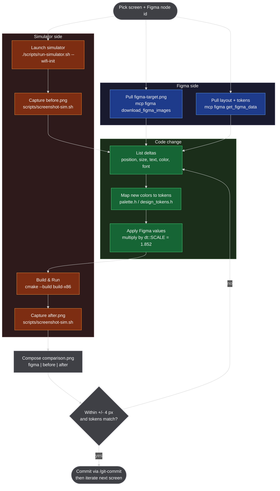

# Figma vs Simulator Iteration Workflow

How we close the gap between a Figma design frame and the EGT UI rendered by the host simulator. The loop produces a 3-up before-vs-target-vs-after image for every change, so progress is visually evident and reviewable.

> **Before starting a new screen, read [../08-references/figma-to-egt-lessons.md](../08-references/figma-to-egt-lessons.md).** It captures the autoresize trap, the "fetch icons, do not draw them" rule, and the pre-flight checklist that saves an iteration or two on every screen.

## Overview

The work is mechanical once you know the tools. Three inputs (a Figma node ID, the matching code file, and a stable mock mode), three outputs (`figma-target.png`, `before.png`, `after.png`), one composed report (`comparison.png`). Every code edit is driven by a Figma measurement scaled by `dt::SCALE = 1.852` and tokens from `src/ui/design_tokens.h` - no raw hex.

The loop relies on three pieces of infrastructure:
- **Stable mock modes** (`EGT_MOCK_WIFI=init`, `connected`, etc.) so the screen we're capturing does not auto-advance.
- **`scripts/screenshot-sim.sh`** to grab the 800x480 client area of the running egt-app window directly (no WM chrome).
- **Figma MCP** (`mcp__figma__get_figma_data` + `mcp__figma__download_figma_images`) to pull the design spec and a target PNG without manual transcription.

## Diagram



The three subgraphs map to where the work happens: orange/`SIM` is the running app on the host, blue/`FIG` is the design source pulled over MCP, green/`EDIT` is the code change Claude or the developer applies.

## Details

### 1. Pick screen + Figma node ID

Open the v5 Figma file (see [Design source](../../README.md#design-source)) and copy the `node-id` from the URL query string. The URL form `node-id=2065-980` corresponds to MCP node id `2065:980`. Decide which `src/screens/screen_*.cpp` is the rendering code for that frame. If multiple screens look like candidates, pick the one whose route is reachable today by some mock mode.

### 2. Stable mock mode

EGT_MOCK_WIFI auto-advances unless we pin it. Available modes today:

| Mode | What it does |
|---|---|
| (unset) | Real WiFi via nmcli + wpa_cli fallback. Auto-advances when host is on WiFi. |
| `1` | Dynamic mock with 12 rotating APs, but `get_current_ssid()` still consults `nmcli` first. Host on WiFi -> auto-advance. |
| `connected` | Forces `WIFI_CONNECTED` success card, holds. |
| `init` | Pins `WIFI_INIT` spinner, holds. Added in commit `c544a93`. |

When you need a screenshot of a screen that does not have a hold mode, add one. Pattern: in the screen factory, detect the env var and skip the timer that drives navigation. The spinner / animations should keep running so the screenshot looks live.

### 3. Capture `before.png`

```bash
./scripts/run-simulator.sh --wifi-init &       # window opens
./scripts/screenshot-sim.sh docs/10-reports/<task>-figma-match/before.png
```

The screenshot script searches X11 for windows named exactly `EGT` and picks the one whose geometry matches `EGT_SCREEN_SIZE` (default 800x480), so it captures the inner content area without the window manager title bar. VSCode users can use the **Screenshot Simulator** status-bar button instead and type the output path at the prompt.

### 4. Pull Figma target

Use the Figma MCP (do not transcribe pixels by hand):

- `mcp__figma__get_figma_data` returns layout (`width`, `height`, `locationRelativeToParent`), fills, gradients, text styles, font family + size, and component references.
- `mcp__figma__download_figma_images` renders the node to a PNG. Always request `pngScale: 2` so the saved image is sharper than the 432x261 canvas natively allows.

Save the PNG as `figma-target.png` alongside `before.png`.

### 5. Diff

Build a small table comparing Figma values against the current code. Useful columns: element, Figma value (raw + scaled), code value, action. The diff is usually 3-6 lines: a text string, a couple of positions, a font size, sometimes a missing icon. Colors rarely diverge if the existing `dt::` tokens are reused.

### 6. Map new colors to tokens (only if needed)

If Figma introduces a hex that does not match any existing color, add a constant in `src/ui/palette.h` and re-export from `src/ui/design_tokens.h`. Never inline `egt::Color(91, 197, 0)` in a screen file. Look for an existing token first - `dt::kGreen` already covers Figma `#5BC500`, `dt::kTextPrimary` already covers `#646569`, etc.

### 7. Apply Figma values to code

Every Figma dimension and position goes through `dt::SCALE = 1.852` to get the 800x480 panel value. Document the source in a one-line comment:

```cpp
// Figma v5 node 2065:980: Spinner 214x214 at (114,20) -> 396x396 at (211,37) scaled.
const int spin_sz = 396;
const int spin_x = 211;
const int spin_y = 37;
```

That comment lets the next reader trace any pixel back to a Figma node without opening the file.

### 8. Build, run, capture `after.png`

```bash
cmake --build build-x86 -j      # ~5-10 s incremental
./scripts/run-simulator.sh --wifi-init &
./scripts/screenshot-sim.sh docs/10-reports/<task>-figma-match/after.png
```

VSCode: **Build & Run** button then **Screenshot Simulator** with the `after.png` filename.

### 9. Compose `comparison.png`

Horizontal layout, left-to-right: **Before | Target | After**. Reading the change as a sentence (was, should be, is) makes regressions easier to spot than a stack would.

```bash
cd docs/10-reports/<task>-figma-match
W=500; H=300                                  # forced size for ALL three panels
LABEL_OPTS=( -resize "${W}x${H}!" -gravity north -background white -splice 0x30
             -fill "#333" -pointsize 18 )
BORDER_OPTS=( -bordercolor "#888" -border 1x1 )

convert before.png       "${LABEL_OPTS[@]}" -annotate +0+5 "BEFORE"         \
                         "${BORDER_OPTS[@]}" labeled-before.png
convert figma-target.png "${LABEL_OPTS[@]}" -annotate +0+5 "TARGET (Figma)" \
                         "${BORDER_OPTS[@]}" labeled-target.png
convert after.png        "${LABEL_OPTS[@]}" -annotate +0+5 "AFTER"          \
                         "${BORDER_OPTS[@]}" labeled-after.png
convert labeled-before.png labeled-target.png labeled-after.png +append comparison.png
rm -f labeled-before.png labeled-target.png labeled-after.png
```

The 1 px gray border around each labeled panel becomes a 2 px gray vertical line between panels after `+append`. That makes panel edges obvious so misalignment of centered elements is easy to see.

**Why the `!` in `-resize "${W}x${H}!"`** — sim screenshots are 800x480 (aspect 1.667) but Figma renders are 864x523 (aspect 1.652, because the design canvas is 432x261 and the device adds a tiny y-overhead). Resizing to a single fixed width with aspect preserved produces panels with slightly different heights, and the Figma panel ends up 2-3 px taller, which makes the design appear "raised" relative to the sim. Forcing the same `WxH!` for every panel removes that drift at the cost of a sub-1 % vertical squish on the Figma render — invisible to the eye and necessary for honest comparison.

`comparison.png` is the shareable artifact for the iteration. Drop it in a PR description, Slack, or Jira comment.

### 10. Decide

Are key elements within `+- 4 px` of Figma and using tokens (no raw hex)? If yes, commit. If no, return to step 5 - usually only one or two values need another nudge.

### 11. Commit

Use the `/git-commit` skill (semantic firmware format). The change usually fits as a single `(MINOR)[fw]` or `(PATCH)[fw]` commit per screen. Reference the Figma node id and any new mock mode in the body for traceability.

## Folder layout

Each task lives under `docs/10-reports/<task>-figma-match/`:

```
docs/10-reports/m4-18-wifi-init-figma-match/
├── figma-target.png   <- pulled via Figma MCP
├── before.png         <- pre-change simulator capture
├── after.png          <- post-change simulator capture
└── comparison.png     <- 3-up vertical stack
```

PNGs are excluded from the repo via the global `*.png` gitignore rule, so these artifacts stay local unless explicitly tracked. To include them in a PR description, upload the comparison image directly to the GitHub PR body.

## References

- Top-level [README - Design source](../../README.md#design-source) - authoritative Figma file (v5, `PBh3UuMmYwdFzalAyPTMBw`).
- [simulator.md](simulator.md) - simulator install, env vars, troubleshooting, per-screen UX checkpoints.
- [useful-commands.md](../07-deployment/useful-commands.md) - Yocto cross-compile + deploy when the change needs target verification.
- `src/ui/design_tokens.h`, `src/ui/palette.h` - color + dimension tokens.
- `scripts/screenshot-sim.sh` - host simulator screenshot helper.
- `scripts/run-simulator.sh` - simulator launcher with `--wifi-static`, `--wifi-init`, `--clean`, `--build` flags.
