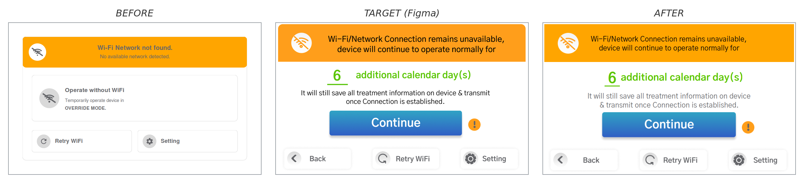
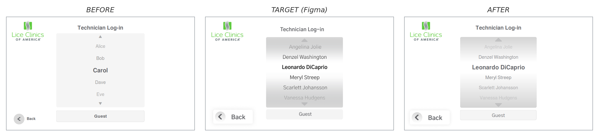

# M4.0 UI Improvement Report

Progress report for the Suntek M4.0 device UI alignment to the Figma v5 design. Process and conventions live in [figma-vs-sim-workflow.md](../04-ide-setup/figma-vs-sim-workflow.md).

## Screens completed

### Wi-Fi Connecting (`WIFI_INIT` - node `2065:980`)

Boot spinner re-aligned to Figma v5: text changed to "Connecting to Wifi", logo enlarged and recentred in the ring.

---

### Wi-Fi Connected (`WIFI_CONNECTED` - node `2065:1068`)

Success card re-laid out: checkmark beside the title on one row, Lice Clinics logo at the top-left, body and Continue button repositioned.

---

### Home (`HOME` - node `81:1507`)

Main menu rebuilt to Figma v5: large blue-gradient Start button, Demo Mode and Setting cards at the bottom with PNG icons and the Figma drop shadow.

---

### Demo Info (`DEMO_INFO` - node `84:608`) - M4-24

Added the missing exit-demo button (top-right) and the chevron icons on the Back and Continue buttons.

---

### Wi-Fi Unavailable (`WIFI_UNAVAILABLE` - node `10:29` area) - M4-19

Screen rebuilt: full-screen orange banner, green countdown number with underline, gradient Continue + orange info icon, and three bottom buttons (Back, Retry WiFi, Setting).

---

### Login (`LOGIN` - node `4008:819`, "S4")

Replaced the custom-drawn Back button (circle + chevron + bold text) with the Figma "bt EXIT" PNG via the shared `ui::add_back_button` helper, so the back affordance now matches the Figma export across all screens that use it.

---

<!--
TEMPLATE FOR THE NEXT ENTRY - copy, fill in, and slot above this comment.

### <Screen name> (`<SCREEN_ID>` - node `<node:id>`) [- ticket]

One short sentence describing what changed.

---
-->

## Pending screens

To be filled in as iterations complete.

## Notes for the reader

- Three states per screen: BEFORE (previous device rendering), TARGET (Figma reference), AFTER (corrected rendering).
- All comparisons are captured from the host simulator at 800x480 - pixel-equivalent to the live panel.
- For animated screens (spinners, transitions), only the static AFTER frame is shown.

## Memory footprint

Snapshot 2026-05-26. Refresh with `scripts/report-memory.sh`.

- **Binary (egt-app):** 3.15 MB on disk; loaded sections 1.45 MB (text 1.43 MB + data 19.9 KB + bss 936 B).
- **Assets:** 147.4 KB total in `assets/`. 48.2 KB is embedded into the binary via `src/generated/embedded_assets.h`; the rest (99.2 KB) loads from disk at runtime.
- **Fonts:** 0 bytes in repo. `Gothic A1` is requested by all screens and must be present in the target rootfs (loaded via fontconfig at runtime).

### Top asset files

| File | Size |
|---|---|
| Lice-logo.png | 48.2 KB |
| wifi-continue-btn.png | 27.4 KB |
| demo-info-btn-continue.png | 18.4 KB |
| wifi-retry-btn.png | 9.3 KB |
| demo-info-btn-back.png | 8.8 KB |
| wifi-setting-btn.png | 8.2 KB |
| wifi-back-btn.png | 8.0 KB |
| wifi-banner-icon.png | 5.0 KB |
| check-circle-green.png | 4.5 KB |
| demo-info-btn-exit.png | 2.9 KB |
