# M4.0 UI Improvement Report

Progress report for the Suntek M4.0 device UI alignment to the Figma v5 design. Process and conventions live in [figma-vs-sim-workflow.md](../04-ide-setup/figma-vs-sim-workflow.md).

## Screens completed

### Wi-Fi Connecting (`WIFI_INIT` - node `2065:980`)

Boot spinner re-aligned to Figma v5: text changed to "Connecting to Wifi", logo enlarged and recentred in the ring.

---

### Wi-Fi Connected (`WIFI_CONNECTED` - node `2065:1068`)

Success card re-laid out: checkmark beside the title on one row, Lice Clinics logo at the top-left, body and Continue button repositioned.

---
    
### Home (`HOME` - node `81:1507`)

Main menu rebuilt to Figma v5: large blue-gradient Start button, Demo Mode and Setting cards at the bottom with PNG icons and the Figma drop shadow.

---

### Demo Info (`DEMO_INFO` - node `84:608`) - M4-24

Added the missing exit-demo button (top-right) and the chevron icons on the Back and Continue buttons.

---

### Wi-Fi Unavailable (`WIFI_UNAVAILABLE` - node `10:29` area) - M4-19

Screen rebuilt: full-screen orange banner, green countdown number with underline, gradient Continue + orange info icon, and three bottom buttons (Back, Retry WiFi, Setting).

---

### Login (`LOGIN` - node `4008:819`, "S4")

Replaced the custom-drawn Back button with the Figma "bt EXIT" PNG so the back affordance matches Figma across every screen that uses it.

---

### Password Prompt (`PASSWORD_PROMPT` - node `144:877`)

Swapped Cancel and Join for the Figma PNG buttons and added the "Forgot Password" link below the input row.

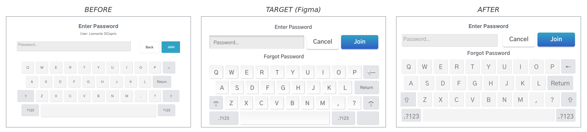

---

### Wi-Fi Connecting (`WIFI_CONNECTING` - node `2065:1005`)

Re-laid out to match the Figma design - spinner is now the full 396 px ring around the Lice Clinics logo with "Connecting to Wifi" beneath, replacing the small spinner + SSID label combination.

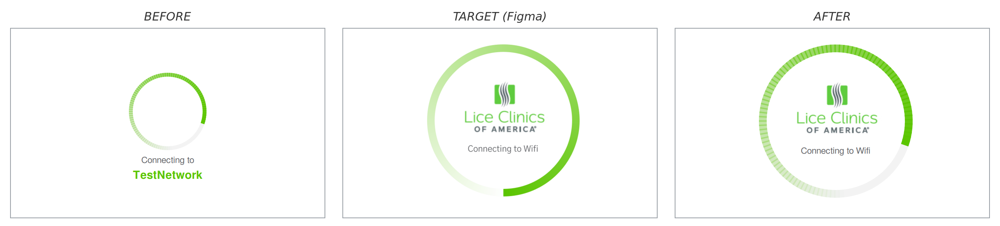

---

### Wi-Fi Override Info (`WIFI_OVERRIDE_INFO` - node `2079:2300`)

Modal now opens over the orange WIFI_UNAVAILABLE banner with the orange info icon top-left and the X close top-right, matching the Figma design.

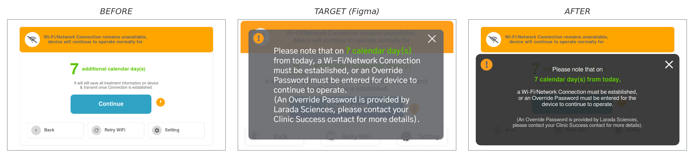

---

### Settings (`SETTINGS` - node `2073:1996`)

Swapped the hand-drawn Wi-Fi and Ethernet glyphs for the Figma PNG exports and brought the About-this-device and card-label font sizes back to the Figma-scaled values.

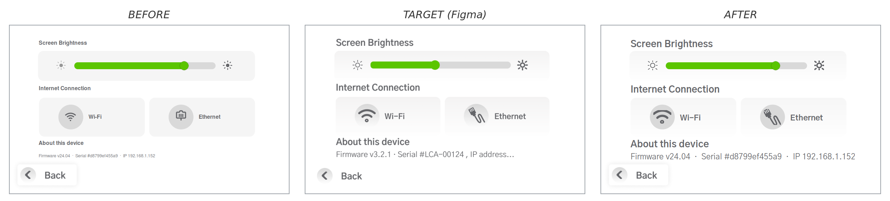

---

### Patient Info (`PATIENT_INFO` - node `168:808` (Gender step))

Added the profile icon next to the "Please Enter Client Information" title and swapped the gender cards' SVG glyphs for the Figma PNG exports.

---

### First Wi-Fi Setup / Wi-Fi Settings (`WIFI_SETTINGS` - node `151:886`)

Rebuilt to F1:1 with Figma: rounded card with the 244→255 keyboard-gray gradient, left-aligned "Choose a Network..." header, real Figma PNG icons on each row, and matched 72×72 gear and Wi-Fi-off pill buttons at the bottom.

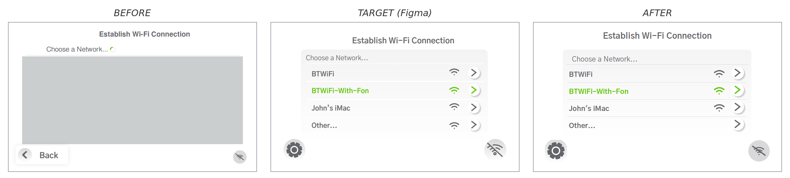

---

### Treatment - Active (`TREATMENT_ACTIVE` - node `66:524`)

Matched the Figma design: the End button is now a white card like Pause instead of a green block, with the countdown, cumulative timer, and buttons resized to the Figma layout.

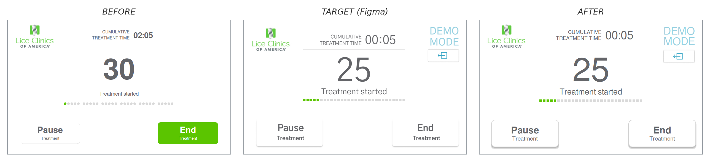

---

### Treatment - Completed (`TREATMENT_COMPLETED` - node `75:320`)

Redesigned to the Figma "Back to Home" completed screen: a blue check beside "Treatment Completed", the cumulative-time header, and a cyan Back to Home button - replacing the earlier minimal big-"0" layout, which left no way off the screen.

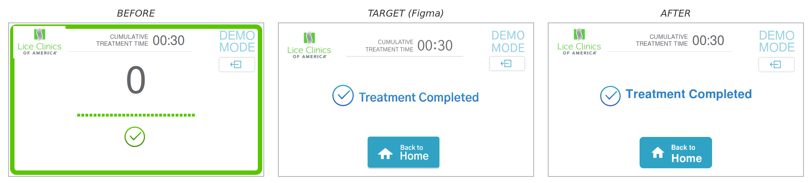

---

### Patient Info - Gender, Demo Mode (`PATIENT_INFO` demo - node `2009:1262`)

Added soft drop shadows to the gender cards and the Back/Skip/Continue buttons, swapped the drawn button glyphs for the exact Figma icons on the 217->255 gradient disc, and tightened the DEMO MODE text and button spacing to the Figma layout.

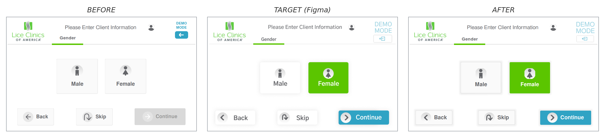

---

### Patient Info - Age, Demo Mode (`PATIENT_INFO` demo - node `2009:1173`)

Added the soft gray cylinder gradient behind the age wheel and the "Years Old" caption to the right of it, both missing before.

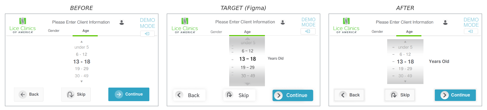

---

### Patient Info - ZIP Code, Demo Mode (`PATIENT_INFO` demo - node `2009:1060`)

Gave the inactive keypad keys the soft gray gradient fill (no border) instead of white-with-border, and switched the Continue/Back glyphs to the Figma chevrons across all patient steps.

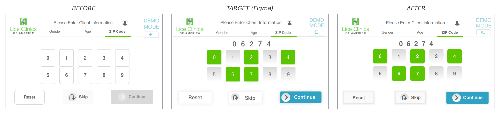

---

### Patient Info - Summary, Demo Mode (`PATIENT_INFO` demo - node `2009:962`)

Reworked the review step to the Figma layout: the three steps now show as outlined pill tabs with a full-width green bar, the summary is borderless (two divider lines instead of a card), and Back + GO sit together centre-bottom.

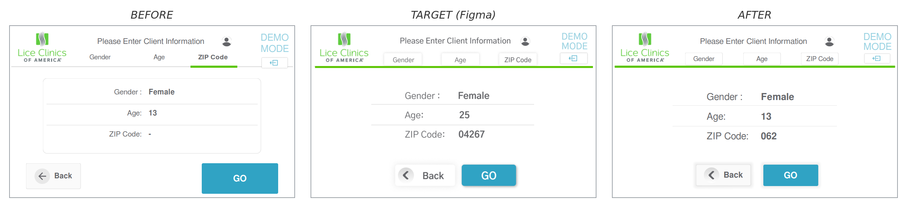

---

### Treatment - Warming up (`TREATMENT` demo - node `37:1626`)

Made the big percentage thin (was bold), tucked the "Warming up for Treatment" label under it, and replaced the thick rounded bar with the thin near-full-width Figma bar.

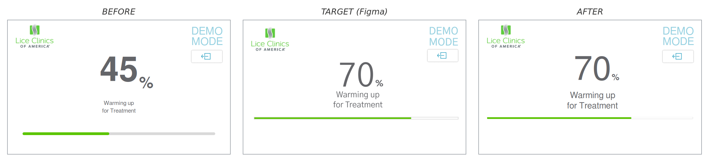

---

### Treatment - Position Tip (`TREATMENT` demo - node `100:772`)

Removed the cumulative-time header (Figma has none here), made the countdown thin and single-minute "M:SS", and enlarged the gray two-line "Position the Applicator Tip" label.

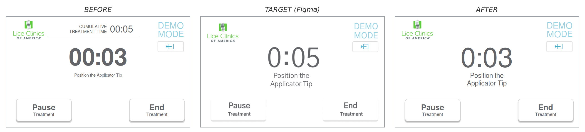

---

### Treatment - Paused (`TREATMENT` demo - node `67:773`)

Made the paused timer thin and gave the tip its two cyan lines flanked by cyan chevrons, matching the Figma copy.

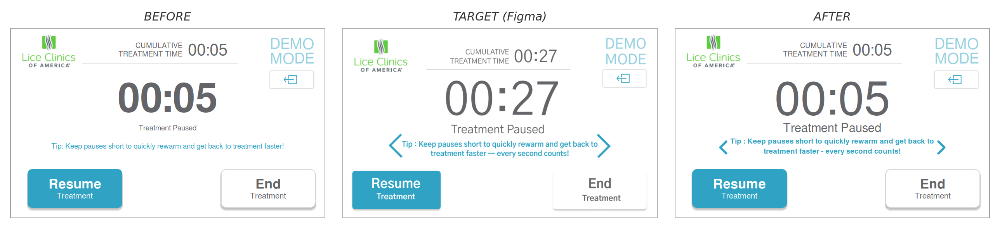

---

### Treatment - Nearly Finished (`TREATMENT` demo - node `67:578`)

Made the countdown thin and enlarged the status text, and added a green gradient glow that fades inward from all four edges (like the age-wheel backdrop, full-screen) and **breathes** smoothly in and out, matching the Figma note that the green reflects a flashing-light effect (node `67:723`). The held screenshot shows the glow at mid brightness.

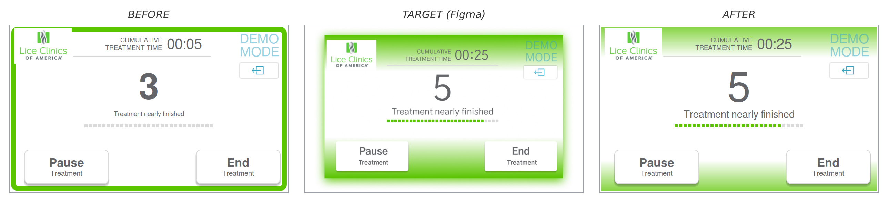

---

### Treatment - Countdown Zero (`TREATMENT` demo - node `67:628`)

The moment the countdown reaches 0: the same breathing-green-glow screen as nearly-finished, now with a big "0", a full green progress bar and a green check. Per the `67:728` note, it breathes and holds ~3 seconds to signal completion, then auto-advances to the Completed (Back to Home) screen.

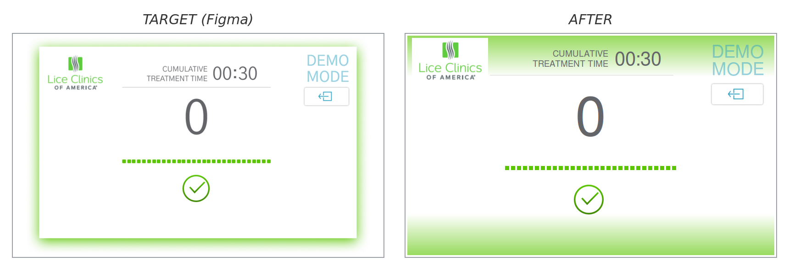

---

<!--
TEMPLATE FOR THE NEXT ENTRY - copy, fill in, and slot above this comment.

### <Screen name> (`<SCREEN_ID>` - node `<node:id>`) [- ticket]

One short sentence describing what changed.

---
-->

## Pending screens

To be filled in as iterations complete.

## Notes for the reader

- Three states per screen: BEFORE (previous device rendering), TARGET (Figma reference), AFTER (corrected rendering).
- All comparisons are captured from the host simulator at 800x480 - pixel-equivalent to the live panel.
- For animated screens (spinners, transitions), only the static AFTER frame is shown.
