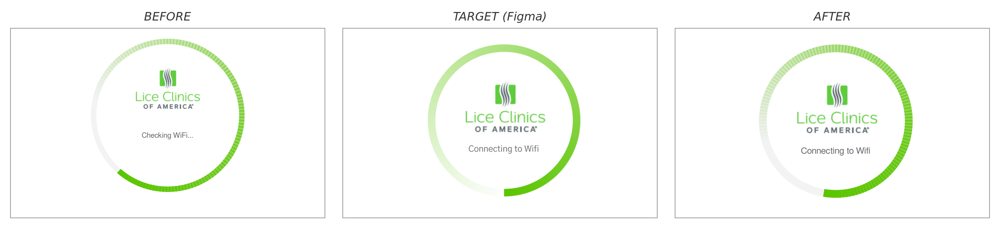
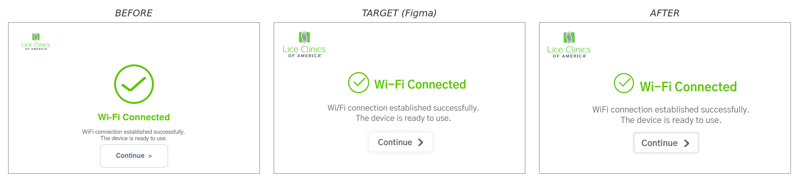
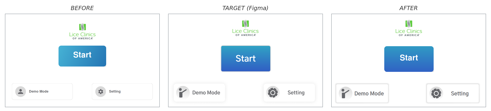

# M4.0 UI Improvement Report

Progress report for the Suntek M4.0 device user-interface alignment to the Figma v5 design (file [`Jason-M4.0-v5`](https://www.figma.com/design/PBh3UuMmYwdFzalAyPTMBw/Jason-M4.0-v5)). Each entry pairs a Figma target with the live simulator output and shows the gap closing.

The process behind each entry is documented in [figma-vs-sim-workflow.md](../04-ide-setup/figma-vs-sim-workflow.md): pull the design via Figma MCP, screenshot the simulator, diff, apply the change, screenshot again, compose a side-by-side image. Every dimension goes through `dt::SCALE = 1.852` (Figma canvas 432×261 pt → device panel 800×480 px) and colours stay on tokens (`dt::kGreen`, `dt::kTextPrimary`, ...) - no raw hex in the code.

## Screens completed

### Wi-Fi Connecting (`WIFI_INIT` - Figma node `2065:980`)

The boot spinner shown while the device looks for and joins a network. Brought into alignment with Figma v5: text changed to "Connecting to Wifi", logo enlarged and recentred in the ring, font bumped to match the scaled Gothic A1 spec.

*AFTER matches the Figma target within roughly ±4 px on key elements (logo, label, spinner geometry). The only visible delta is the spinner's gradient rotation, which animates in the live UI.*

---

### Wi-Fi Connected (`WIFI_CONNECTED` - Figma node `2065:1068`, Group 266)

The success card shown once the device joins the network. Re-laid out per Figma v5: the checkmark sits beside the title on the same row (instead of the previous stacked layout), the Lice Clinics logo grows to fill the top-left corner, body copy and the Continue button are positioned per the new spec.

*AFTER matches the Figma target within roughly ±4 px on all main elements. Every position, size, and font value comes from the Figma node multiplied by `dt::SCALE = 1.852`; colours stayed on existing tokens.*

---

### Home (`HOME` - Figma node `81:1507`, "S7-begin T")

The main menu of the device - three actions: a large blue gradient Start button to begin a treatment, plus Demo Mode and Setting cards at the bottom. Re-laid out per Figma v5: Lice Clinics logo at exact top-centre, Start button sized and positioned per spec, the two bottom cards shrunk and repositioned to Figma's `(20, 365)` and `(496, 365)`. Both card icons (person and gear) now load from real Figma PNG exports - including the gray circle backgrounds - instead of being drawn from inline SVG strings. Cards now show the Figma drop shadow via the shared `ShadowedCard` widget.

*AFTER matches the Figma target on layout, icon style, card sizing, and drop shadow. Same `Gothic A1 Bold` font as the rest of the design, same `dt::kTextPrimary` for label colour.*

---

<!--
TEMPLATE FOR THE NEXT ENTRY - copy, fill in, and slot above this comment.

### <Screen name> (`<SCREEN_ID>` - Figma node `<node:id>`)

One or two sentences describing what this screen is for and what changed.

*AFTER matches the Figma target within roughly ±N px on key elements. <Optional note on any residual delta>.*

---
-->

## Pending screens

To be filled in as iterations complete.

## Notes for the reader

- Three states are shown per screen: **Before** (the previous on-device rendering), **Target (Figma)** (the design reference), **After** (the corrected on-device rendering).
- All comparisons are captured from the host simulator at the device resolution (800×480) so what you see is pixel-equivalent to the live panel.
- Where the design introduces an animation (a rotating spinner, a transitioning state), only the static AFTER frame is shown; the animation itself is preserved in code.
