# M4 EGT UI — Wireframe & Flujo actual

> Reporte generado capturando pantalla por pantalla del simulador (build
> `develop @ 57f72a7`, 800×480). Documenta **cómo se ve hoy cada screen** y
> **cómo se conectan** en el flujo de la app.
>
> - Vista general de todas las pantallas: [`wireframe-all.png`](wireframe-all.png)
> - PNGs individuales full-res: [`screens/`](screens/)
> - Thumbnails etiquetados: [`thumbs/`](thumbs/)
>
> Nota: la fuente que se ve es DejaVu (fallback) — la fuente de diseño
> Gothic A1 está pendiente de instalar a nivel Linux (duda D1). En el
> dispositivo final el texto será un poco más angosto.

---

## Mapa de flujo

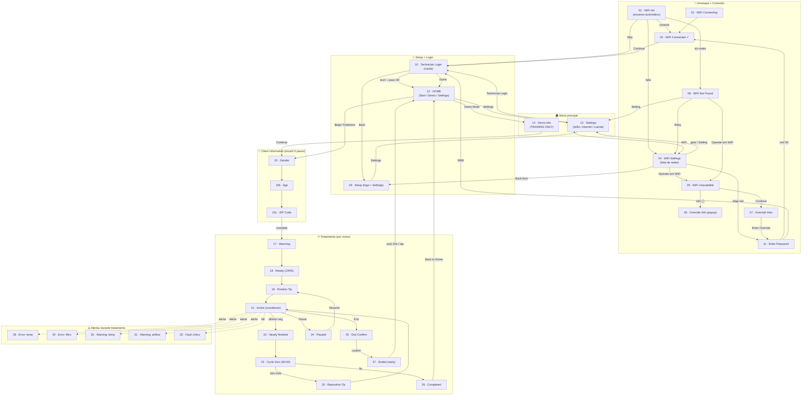

---

## Galería — todas las pantallas

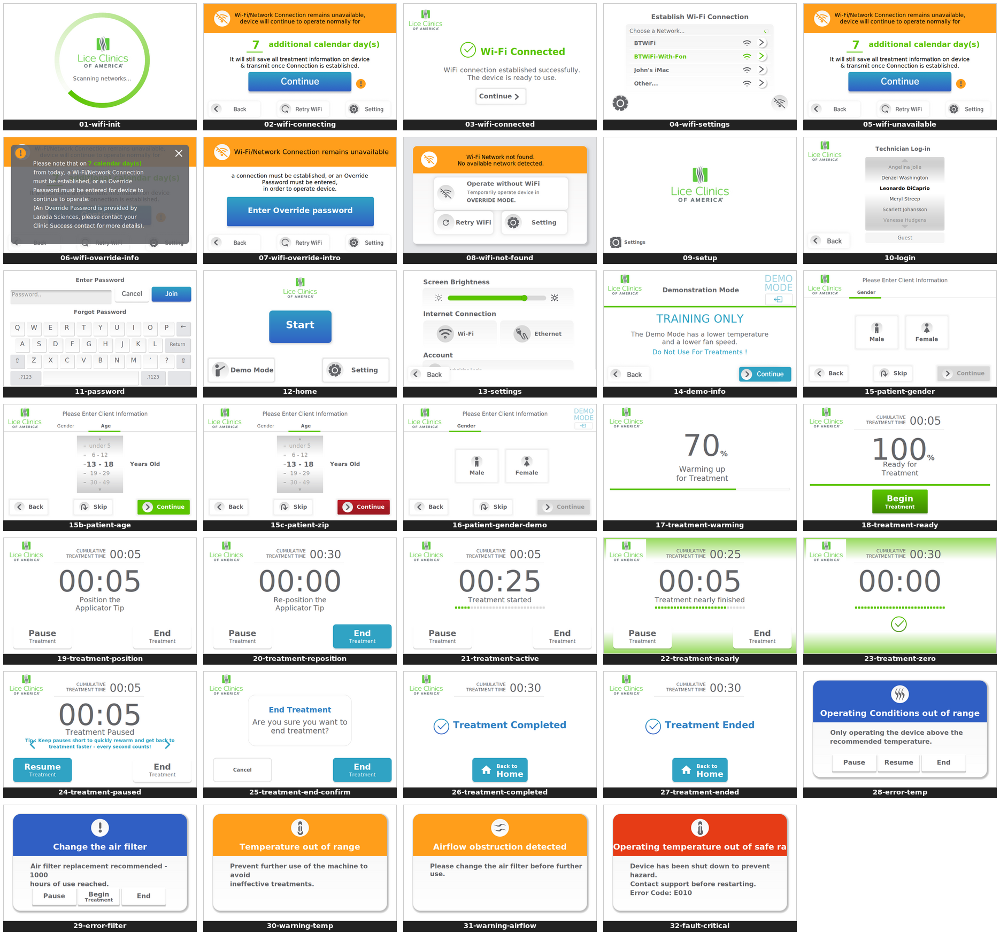

---

## 1 · Arranque + Conexión WiFi

| | Pantalla | Qué muestra / qué hace |
|---|---|---|
| 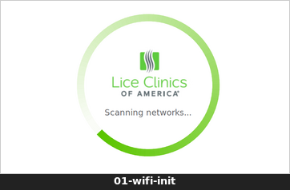 | **WiFi Init** | Logo centrado + spinner. Escaneo automático al bootear. Sale a: Connected (éxito), WiFi Settings (falla), Login (skip). |
| 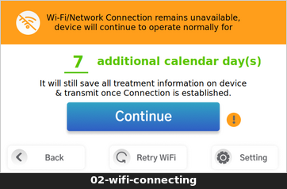 | **WiFi Connecting** | Anillo de progreso animado mientras intenta unirse a una red elegida. |
| 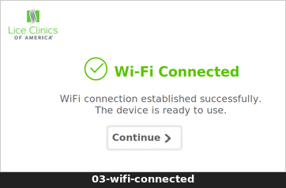 | **WiFi Connected** | Check verde + "Wi-Fi Connected". Botón **Continue** → Technician Login. |
| 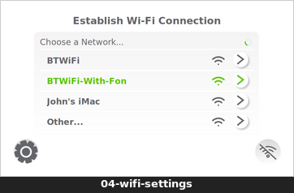 | **WiFi Settings** | Lista de redes (señal + chevron). Tap red → password. Gear → Settings. Icono wifi-off → operar sin WiFi. |
| 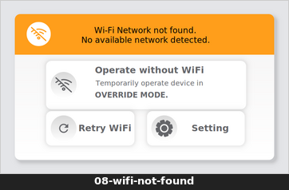 | **WiFi Not Found** | Banner naranja. 3 tarjetas: Operate without WiFi / Retry WiFi / Setting. |
| 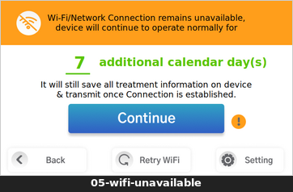 | **WiFi Unavailable** | "Connection remains unavailable — N días". Continue → Override Intro. ⓘ → popup. |
| 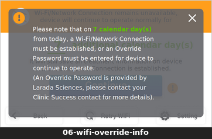 | **Override Info (popup)** | Overlay oscuro explicando el override (N días, contactar Larada Sciences). X cierra. |
| 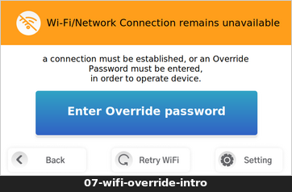 | **Override Intro** | Botón grande **Enter Override password** → keypad. Fila Back/Retry/Setting. |
| 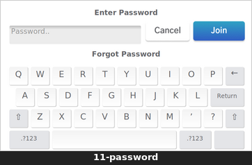 | **Enter Password** | Teclado completo. Usado para password de red, override ("9999") y login de técnico. |

## 2 · Setup + Login

| | Pantalla | Qué muestra / qué hace |
|---|---|---|
| 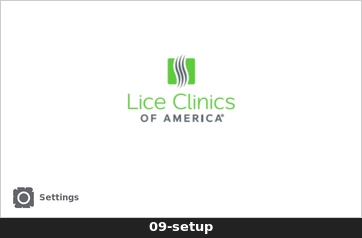 | **Setup** | Landing con logo + afordancia **Settings** abajo. Punto de retorno del boot (no salta el login). |
| 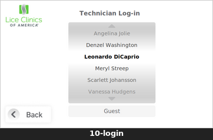 | **Technician Login** | Rueda de técnicos (tap selecciona/abre password). Botón **Guest**. Back → Setup. |
| 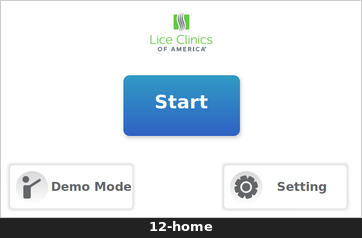 | **HOME** | Logo + botón **Start** (gradiente cyan). Tarjetas **Demo Mode** y **Setting**. |

## 3 · Menú principal

| | Pantalla | Qué muestra / qué hace |
|---|---|---|
| 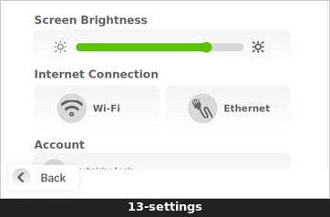 | **Settings** | Brillo (slider), Internet Connection (WiFi/Ethernet), sección Account (Technician Login) + About this device. Scrollable. |
| 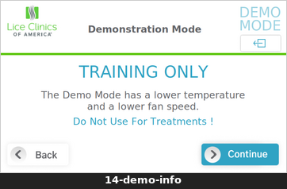 | **Demo Info** | "TRAINING ONLY" + badge DEMO MODE. Continue → Client Info (demo). |

## 4 · Client Information (wizard 3 pasos)

| | Pantalla | Qué muestra / qué hace |
|---|---|---|
| 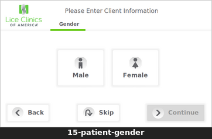 | **Gender** | Tarjetas Male / Female. Back / Skip / Continue. |
| 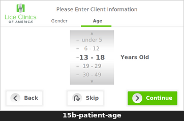 | **Age** | Rueda de rangos etarios (under 5 … 50+). |
| 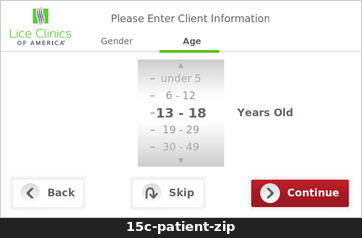 | **ZIP Code** | Keypad 0-9. Continue se habilita solo con 5 dígitos. Reset / Skip. |
| 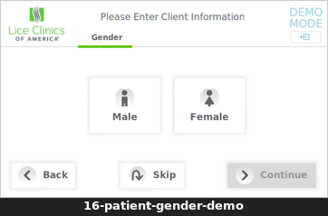 | **Gender (Demo)** | Misma pantalla, badge DEMO MODE; acentos cyan en vez de verde. |

## 5 · Tratamiento (por ciclos)

| | Pantalla | Qué muestra / qué hace |
|---|---|---|
| 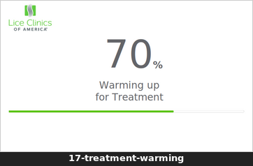 | **Warming** | "70% — Warming up". Barra de progreso de calentamiento. |
| 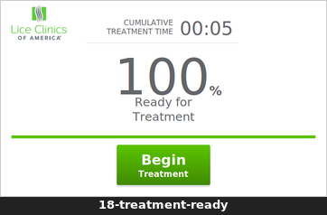 | **Ready** | "100% — Ready for Treatment". Botón **Begin Treatment**. |
| 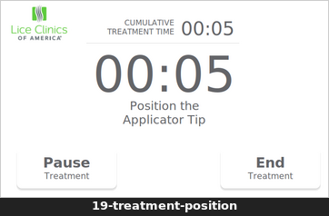 | **Position Tip** | Countdown `00:05` "Position the Applicator Tip". |
| 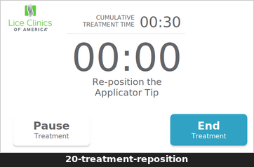 | **Reposition Tip** | Igual a Position pero entre ciclos ("Reposition…"). |
| 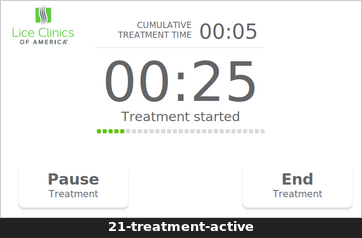 | **Active** | Countdown grande `00:25`, "Treatment started", dots por ciclo, Pause/End. |
| 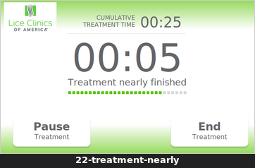 | **Nearly finished** | Glow verde respirando + dots casi llenos. Últimos segundos del ciclo. |
| 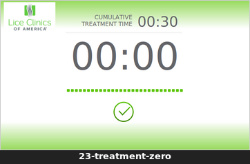 | **Cycle Zero** | `00:00`, barra llena verde + check. Fin de ciclo → otro ciclo o Completed. |
| 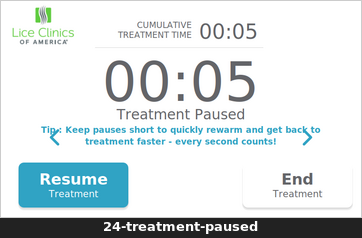 | **Paused** | "Treatment Paused". Resume / End. Resume vuelve a Position Tip. |
| 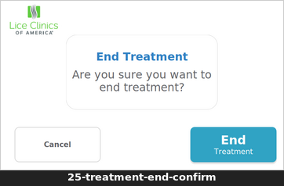 | **End Confirm** | "Are you sure you want to end treatment?" Confirmación antes de terminar. |
| 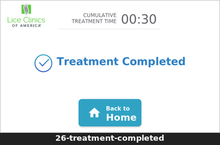 | **Completed** | Check azul + "Treatment Completed". **Back to Home**. |
| 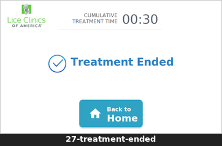 | **Ended (early)** | "Treatment Ended" (fin anticipado). Auto-retorno a Home en ~20s. |

## 6 · Alertas durante tratamiento

| | Pantalla | Qué muestra / qué hace |
|---|---|---|
| 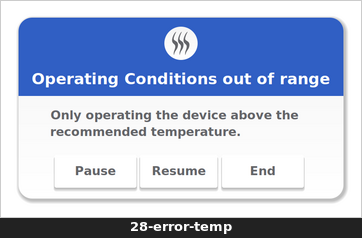 | **Error: temp** | Modal azul "Operating Conditions out of range". Pause / Resume / End. |
| 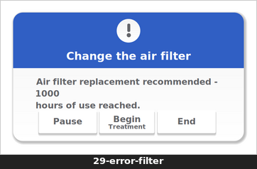 | **Error: filtro** | Modal azul "Change the air filter". Pause / Begin / End. |
| 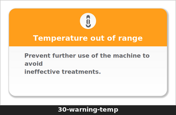 | **Warning: temp** | Modal naranja "Temperature out of range". Sin botones (informativo). |
| 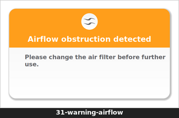 | **Warning: airflow** | Modal naranja "Airflow obstruction detected". |
| 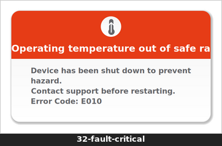 | **Fault crítico** | Modal rojo "Operating temperature out of safe range" + Error Code. Shutdown. |

---

## Notas

- **Fuente**: todo el texto se renderiza con DejaVu (fallback). La fuente de
  diseño **Gothic A1** está pendiente de instalar a nivel Linux (duda D1);
  con ella el texto será más angosto y fiel a Figma.
- **Estado de paridad con Figma**: las pantallas pasaron por el sweep de
  parity (ver [`../figma-parity/`](../figma-parity/)) — coinciden con el
  diseño salvo la fuente y las decisiones de producto abiertas (D2-D7).
- **Cómo reproducir una pantalla**: `EGT_START_SCREEN=<nombre> ./build-x86/egt-app`
  (las de tratamiento: `EGT_START_SCREEN=treatment EGT_MOCK_TREATMENT=<estado>`).
